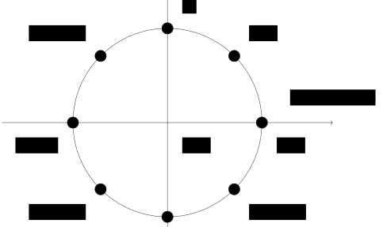
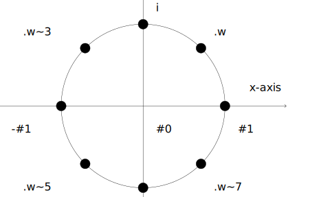
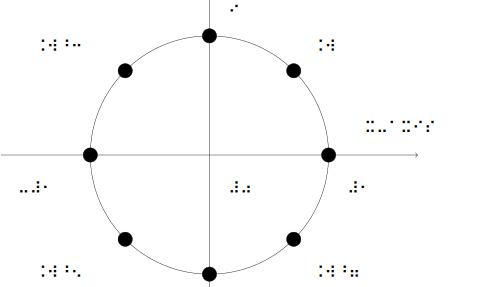
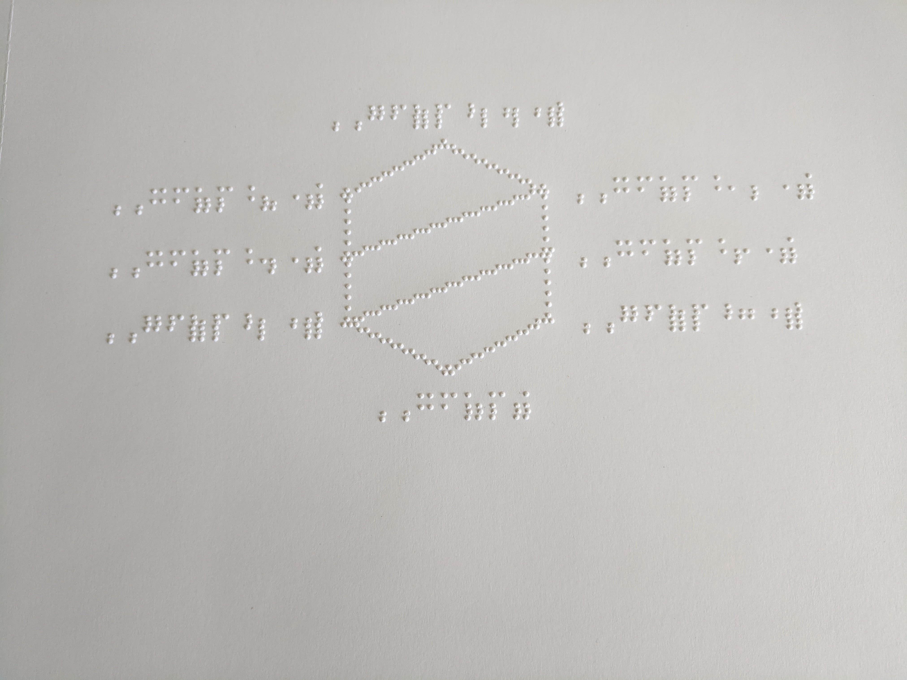
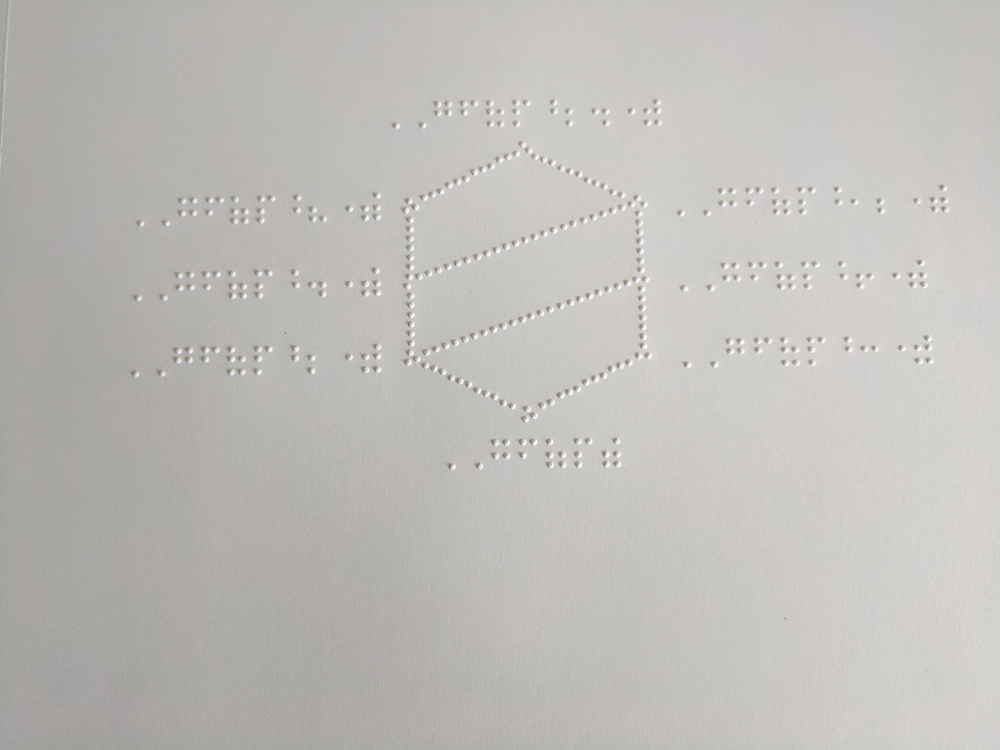
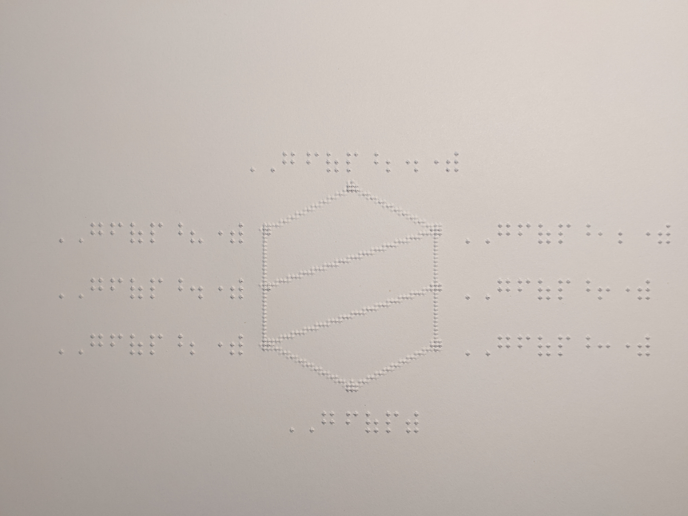

***Head

:::Icon logos/favicon.ico
:::CSS node_modules/normalize.css/normalize.css minify
:::CSS Resources/styles.css minify
:::Script Resources/scripts/mathjax-conf.js minify
:::Script https://cdn.jsdelivr.net/npm/mathjax@3.1.0/es5/tex-mml-chtml.js
:::Script Resources/scripts/cacc.js
:::Script Resources/scripts/cacc-conf.js minify
:::Script Resources/scripts/general-conf.js minify
:::

***

***TitleSlide

:::Title Automated Generation of Tactile Mathematics
:::
:::Author Volker Sorge
[v.sorge@progressiveaccess.com](mailto:v.sorge@progressiveaccess.com)
:::

***Affiliations
:::Affiliation
University of Birmingham, UK
{height=150}
[cs.bham.ac.uk/~vxs](https://www.cs.bham.ac.uk/~vxs)
:::


:::Affiliation
MathJax Consortium
{height=150}
[mathjax.org](https://mathjax.org)
:::

:::Affiliation
Progressive Accessiblity Solutions
{height=150}
[progacc.com](https://progressiveaccess.com)
:::

:::Affiliation
Indian Instiute of Technology, Delhi
{height=150}
[iitd.ac.in](https://iitd.ac.in)
:::

*******************

## Background

* [Raised mathematics project](https://github.com/raised-mathematics)
* Automatically translate mathematical literature into tactile formats
* Mainly aimed at advanced math textbooks and articles
* Project is a mix of reseach and novel technical development

## The Team

{width=200}
{width=200}
{width=200}
{width=200}
{width=200}
* Al Maneki, Senior STEM Advisor NFB 
* Rob Beezer, Pudget Sound University, PreTeXt 
* Alexei Kolesnikov, Towson University 
* Michael Cantino, Certified Nemeth Transcriber 
* Volker Sorge, Uni Birmingham, MathJax 

plus Martha Siegel, Karen Hartenstein, David Farmer

## The Sponsors

* American Action Fund: Two project phases
* American Institute of Mathematics: Logistics 

Others for individual projects
* PreTeXt: currently via NSF Utmost grant
* MathJax: [around 30 Partners and Sponsors](https://www.mathjax.org/#sponsors)
* Speech Rule Engine: Big Ten (Braille), TextHelp (Localisations), others

## Initial Problem

{width=500}
{style="float:right;"}

* No reliable, fast, and inexpensive way of producing Braille versions of mathematics texts.
* Several tools will produce convincing-looking, but incorrect output.
* Situation is particular bad for graduate texts
* And getting worse for research papers, etc.


## Creating Tactile Hardcopies

Translate textbooks automatically into Braille from source

Overview of the workflow

* Sources in PreTeXt
* Text into literary Braille with LibLouis
* Math into Nemeth with MathJax and Speech Rule Engine
* Graphics into tactile graphics via a multistep pipeline


## What is PreTeXt?

[PreTeXt](https://pretextbook.org/) is a an uncomplicated XML vocabulary for
open source textbooks, monographs, and research articles.

* Structure in XML
* Mathematics in LaTeX
* Graphics mainly in LaTeX
* One source, many outputs:
  * print, PDF, web, EPUB, Jupyter Notebooks, ...
* [Over 100 individual projects](https://pretextbook.org/catalog.html): 
  * mainly Math, some CS and engineering
  * one music theory, one university writing handbook

**In our context:**{style="color:red"} provides free and well curated content

## What is LibLouis?

[LibLouis](http://liblouis.org/) open-source software suite for Braille translation
* Support multiple languages and Braille formats
* Used by many screen readers as Braille library
* Liblouis has some math capabilities, but they are very limited
  * Can process some MathML
  * But output is very poor (often even incorrect)

**In our context:**{style="color:red"} translation of literary text and document structure


## What is MathJax?

* [MathJax](http://www.mathjax.org) is an open-source JavaScript library for
  rendering Mathematics in all browsers
* Can take {\LaTeX}, AsciiMath, and MathML as input
* Generates browser output, e.g. HTML/CSS, SVG
* MathJax is the de facto rendering solution of most Mathematics on the web
* Standard Maths rendering solution for many publishers
* Around for over 10 years, lastest version 3.1 released Aug 2020

**In our context:**{style="color:red"} translation of LaTeX to Nemeth Braille

## Speech Rule Engine

* Javascript library for translating Math into Speech [available at github](github.com/zorkow/speech-rule-engine)
* Only Math speech solution in JavaScript: Runs in browser, command line, as node module.
* Speech solution for: ChromeVox, MathJax, EquatIO, MathLive, \ldots
* Based on semantic interpretations via pattern matching techniques
    * Ignores any poor syntax (or at least tries to)
    * Math markup (e.g., LaTeX, MathML) are not very expressive, sometimes bloated


## Generate Semantics

* Consider $ax^2+bx+c=0$. [SRE](https://github.com/zorkow/speech-rule-engine) rewrites this into
  [semantic term
  structure](https://zorkow.github.io/semantic-tree-visualiser/visualise.html?310000111100%3Cmath%3E%0A%20%20%3Cmi%3Ea%3C/mi%3E%0A%20%20%3Cmsup%3E%0A%20%20%20%20%3Cmi%3Ex%3C/mi%3E%0A%20%20%20%20%3Cmn%3E2%3C/mn%3E%0A%20%20%3C/msup%3E%0A%20%20%3Cmo%3E+%3C/mo%3E%0A%20%20%3Cmi%3Eb%3C/mi%3E%0A%20%20%3Cmi%3Ex%3C/mi%3E%0A%20%20%3Cmo%3E+%3C/mo%3E%0A%20%20%3Cmi%3Ec%3C/mi%3E%0A%20%20%3Cmo%3E%3D%3C/mo%3E%0A%20%20%3Cmn%3E0%3C/mn%3E%0A%3C/math%3E){target="_blank"}

```LaTeX
    ax^2+bx+c=0
```
```html
<math>
  <mi>a</mi>
  <msup>
    <mi>x</mi>
    <mn>2</mn>
  </msup>
  <mo>+</mo>
  <mi>b</mi>
  <mi>x</mi>
  <mo>+</mo>
  <mi>c</mi>
  <mo>=</mo>
  <mn>0</mn>
</math>
```

## Nemeth in SRE

Sponsored by Big Ten Academic Alliance{.small}
* Once semantics is embedded speech and other alternative formats can be easily generated
* Tactile output, Abstraction, Summaries
  $$ \vec{\nabla} \times \vec{F} =
            \left( \frac{\partial F_z}{\partial y} - \frac{\partial F_y}{\partial z} \right) \mathbf{i}
          + \left( \frac{\partial F_x}{\partial z} - \frac{\partial F_z}{\partial x} \right) \mathbf{j}
          + \left( \frac{\partial F_y}{\partial x} - \frac{\partial F_x}{\partial y} \right) \mathbf{k}
   $${#braille}

:::Standalone Click or focus on the formula and press <kbd>ENTER</kbd> to start, <kbd>Escape</kbd> to quit.
:::


## MathJax on the Server

* work on the server as easily as in the browser
* works in non-standard DOMs (e.g., markdown or PreTeXt)
* separable pipeline for
    * finding
    * converting
    * annotating
    * rendering math
* E.g., LaTeX in a document can be translated into SVG with speech or Braille annotation.

## 2D in Nemeth

* Nemeth for embossing requires 
  * Large fractions
  * Matrices, vectors
  * Equation systems
  * Cayley tables
* SRE can generate 2D output
* Uses same rules as for Braille display output during screen reading
* Applies abstract styling rules
* [Some sample output](https://speech-rule-engine.github.io/sre-tests/output/nemeth/Nemeth2D.html)


## Quality Assurance

* We developed a [Webapp for Nemeth Translation](https://nemeth-project.web.app/)
* Basic idea:
    * Proof read and correct automatically translated math
    * Easy reference to context via links source
    * Selection of semantically unique samples vs full list of expressions


## Some Challenging Examples

Nemeth is challenging to get right automatically, but sometimes automation is better:

* Subtlety of spaces:
   * $44\,352\,000$ is a single number and transcribes as ⠼⠲⠲⠒⠢⠆⠴⠴⠴ 
   * $(0110\,1110\,0110)$ is not a single number but a vector, hence ⠷⠼⠴⠂⠂⠴⠀⠼⠂⠂⠂⠴⠀⠼⠴⠂⠂⠴⠾
   * $(n, E) = (451{,}231)$ [The right hand side is not a single number](http://abstract.ups.edu/aata/exercises-crypt.html#grE) ⠷⠝⠠⠀⠠⠑⠾⠀⠨⠅⠀⠷⠲⠢⠂⠠⠀⠆⠒⠂⠾
* Context helps
    $$PAP^{-1} = B$$
    [is not an abbreviation](http://abstract.ups.edu/aata/section-sets-and-equivalence-relations.html#mDC): ⠠⠏⠠⠁⠠⠏⠘⠤⠂⠀⠨⠅⠀⠠⠃


## What about Diagrams?

* Automated generation of tactile graphics is challenging
* Advanced, bespoke content 
* Generated with LaTeX packages
* Many Standard techniques do not work

[Some examples from Abstract Algebra](http://abstract.ups.edu/aata/aata.html)
* [Fairly easy relations](http://abstract.ups.edu/aata/section-sets-and-equivalence-relations.html#Ilt)
* [Large graphics with interspersed math](http://abstract.ups.edu/aata/section-mod-n-sym.html#lqf)
* [Lattices](http://abstract.ups.edu/aata/section-fund-theorem-galois-theory.html#TrF), [Category theory](http://abstract.ups.edu/aata/section-fund-theorem-galois-theory.html#QwZ), etc.


## Processing Labels

* Easy: Separate Text vs Math
  * PreTeXt already does the for us: Text vs LaTeX
  * Translate Text with Liblouis
  * Translate Math with SRE 
* Hard: Fitting labels into graphic
  * Braille uses different space than text
  * Labels are measured
  * Bounding boxes are created and aligned


## Example: Latex to Tactile

Source: [Tom Judson, Abstract Algebra: Theory and Application](http://abstract.ups.edu/sage-aata.html)
{.source}


{align="center"}


## Workflow Example

* Creating Braille bounding boxes in the diagram


{align="center"}


## Workflow Example

* Fitting ASCII Braille into bounding boxes


{align="center"}


## Workflow Example

* Full rendering in Unicode Braille Font


{align="center"}


## Diagrams for Screenreading

* Once the graphics are understood we can do much more
* Diagrams can be handled via screen readers as well

:::Diagcess unitcircle Resources/pretext/roots-of-unity-noscale.svg Resources/pretext/roots-of-unity-noscale.xml minify
:::

:::Standalone Click or focus on the diagram and press <kbd>A</kbd> to start, <kbd>Escape</kbd> to quit, <kbd>Escape</kbd> to quit.
:::


## Talking to the Embosser

* The entire image is measured and scaled as much as possible to fit onto a page
* Good-looking image on the screen frequently does not look good embossed
* Result is usually suboptimal
    * Scaling of graphics should not apply to Braille
    * Embosser do not work well with SVG
* Conversion to PDF necessary
* Fonts need to be explicitly un-embedded


## Example: Poorly embossed

{width=700}
{align="center"}

* Diagram in PDF with fonts

## Example: Legibly embossed

{width=700}
{align="center"}

* Unembedded fonts

## Example: Best solution

{width=700}
{align="center"}

* Smoothing applied

## State of the Project

* Text/Math conversion automated and of good quality
* Many books of the [PreTeXt catalogue](https://pretextbook.org/catalog.html)
  can be translated
* Graphics conversion partially automated when generated with LaTeX (tikz)
* Two AIM workshops: one online in 2020, upcoming at NFB in July 2022
* Upcoming third phase:
  * Improved pagination and line breaking
  * Formula breaking in text
  * Formula breaking and intendation in 2D 
  * Fully automated workflow for graphics
  * Automatic translation of category theory diagrams with MathJax
  [(Example)](http://abstract.ups.edu/aata/section-field-automorphisms.html#proof-193)

## Future Work

* Native rendering of Graphics
  * Implement main Math graphics packages in MathJax
  * Output formats for screen reading, Braille, audio-tactile
  * We can already do that for Chemistry
* Internationalisation with ICEVI: 
  * Additional languages and conventions 
  * Other math Braille formats
